[#Back-to-Top""]
= Arduino MIDI translator
Vladistone <vl2guitar@gmail.com>
:toc:
:toclevels: 3
:doctype: book
:sectnums:
:sectnumlevels: 3
:experimental:
:source-highlighter: pygments
:source-language: cpp
:tip-caption: pass:[&#128161;]
:warning-caption: pass:[&#9888;]
:note-caption: pass:[&#128204;]
:caution-caption: pass:[&#8252;]
:synth_upgrade_instruction: to be created as soos as possible
:code_implement_instruction: to be created as soos as possible
:readme_content: at this moment I’m just gathering my thoughts and the description of README2 is still in its starting state, as soon as possible I will add blocks and pictures of examples of both synthesizers and analysis of the code and its internal blocks with explanations

|===
|Last update of text: |`2023-12-10 (v0.01.0)`
|Last update of relevant screenshots: |`2023-12-10 (v0.01.0)`
|===

kbd:[<<Back-to-Top>>]

== Quick start

Here's a step-by-step guide to help you get started with Arduino and a MIDI controller:

. Download & Start Arduino IDE.
. If you haven't already done it, https://www.arduino.cc/en/software[install Arduino IDE].
. Connect your Arduino board to your computer and check the board is recognized for IDE.
  * For the Arduino board device, tick for your `device name` in menu: kbd:[*tool*] → kbd:[*device*] → from avalable devices list
  * and tick your `Port` for connection in menu: kbd:[*tool*] → kbd:[*Port*] → from avalable port list
. Make sure `MIDI_library.h` is enabled in `Include Librarys` list: kbd:[*Sketch*] → kbd:[*Include Library*] checl the `Librarys list`
. if you need, step the next: → kbd:[*Manage Librarys*] `⇧⌘i` kbd:[*download*] or kbd:[*upgrade*] the `MIDI_library.h`
. Open the sketch file and check the compilation for no compilation errors: kbd:[*Sketch*] →  kbd:[*check/compilation*] `⇧⌘R`. 
. if compilation was successful - upload the sketch to Arduino: kbd:[*Sketch*] →  kbd:[*Upload*] `⇧⌘U`.
+
--
*All done*...
 Relax and take it easy! or wait a minute... - false start...
[WARNING]
since if you have read up to this point...
then you are probably a noob like I was at the beginning of this journey of getting to know arduino world...
[TIP]
But if you have experience with Arduino codes, then you have probably already
begun to analyze the mapping template of <<inplementation>> for convenience and compatibility for your *Cntrl_2_Synth* equipment...  and is whether need it to adapt by custom remap?
[NOTE]
:MIDI_code_preset_content: There are many controllers projects for synth manipulation by Arduino chipping.
And although technically possible in exactly the same way as with controller presets for factory MIDI devices,
Ctlr_2_Synth map layouts are very custom, so I'm no sure yet if it would make much sense to create map presets of code...
but the base approach to the system of developing code for `Arduino MIDI translator` and consistency in adapting MIDI implementation has already been launched and this requires publicity...
*Show must go on...*

...So, after downloading the sketch to the Arduino:
--
+
. That time has come to adapt the Arduino to staff of MIDI devices! and
. Check the functionality of this sketch in working condition or by simulating MIDI monitoring by PC. To do this, you will require:
  * a separate MIDI interface and a shield for Arduino to connect to PC with make a MIDI loop through Arduino Rx/Tx...
  * or take a soldering iron and wire cutters in your hands to carry out a "surgical operation" to chip into the circuit board of synth!
. For this purpose, there is no need for me to describe all the details of the analysis of the code’s performance under gear working condition. I creat <<troubleshooting>> chapter,
Or you can ask a question in a discussion on the forum https://gearspace.com/board/electronic-music-instruments-and-electronic-music-production/1418944-korg-dss-1-arduino-upgrade-project.html[gearspace.com]

kbd:[<<Back-to-Top>>]

== Introduction and a bit history

[TIP]
The great idea is to organize a repository for codes of `Arduino MIDI translator` in one place, which to accumulate projects related to the rare synths from 80-90 y.,
by Arduino upgrading to facilitate focused share knowledge, and foster collaboration among musicians & coder enthusiasts.
May be this dedicated space will serve as a hub for users to exchange code mapping, ideas, troubleshoot,
and showcase their projects or branching related to the any synths upgrade by Arduino,.. Time will show...

MIDI implementaion developing
[.text-justify]
====
The Korg <<DW8000>>; <<EX8000>> and <<DSS-1>> (and other early hybrid synthesisers) was created during the early days of MIDI, before things like `CC#` messages were standardised.  As a result, it uses proprietary `SysEx` commands to change parameters over MIDI. Most modern MIDI controllers use `CC#` messages instead, and very few are flexible enough to be able to send the appropriate `SysEx` messages. Those similar project uses an embedded Arduino Nano (or clone) mounted inside the synth body, which is used to intercept the MIDI IN data just before it reaches the CPU of synth. It replaces specific `CC#` messages with `SysEx` messages that the sysnthesizer understands them.
====

The project start from 5th July 2016 and based on a hack https://hackaday.io/project/12541-korg-dw-8000-midi-enhancer[Korg DW8000 midi enhancer] publication by Steve Baines https://github.com/sjbaines/Korg_DW-8000_Midi_Enhancer[and his code repo]. As His discribed His code was tested and may have been stable, but by the time November 2023, when I discovered this project on the network - I could not immediately run it on the EX8000.
It turned out to be non-working and required debugging. The pull request were added after fixing, but I did not find any activity from the project's master.
So therefore, I independently continued the path of adapting the project for Korg DSS-1, thanks to mentoring from experienced Arduino C++ coder. I achieved the first results literally a week after for EX8000 and the analysis differences between DW8000 vs DSS-1 of <<inplementation>> with <<troubleshooting>>.

kbd:[<<Back-to-Top>>]

=== What is Arduino MIDI-translator?

Probably you know already that Arduino is a sort ofimprovement or upgrade over Synth's built-in MIDI interface circuit diagram. But what is it exactly? Let me put it this way:

____
Arduino is an IC board which will allow you to take whatever MIDI controller you have, be it a keyboard or some fader box, plug it in and  tune changing of the parameter of synth…
regardless of whether your oldschool synthesizer can read `CC#` commands or not.

And for such pleasures as independence from expensive specialized controllers or the not need to be chained to a computer for software MIDI translation,
you can, together with other performance equipment give a new life to old synthesizers from the 80s such as the Korg DSS-1  using Arduino and with programming skills!
____

This Simple Arduino project to remap MIDI `CC#` messages into `SysEx` messages that Korg DSS-1 Synth expects.

The practical upshot of this is that the Synth Program parameters can be controlled by standard `CC#` messages, rather than obscure `SysEx` messages.
MIDI THRU is unaffected by the changes, as the Nano is be spliced in just before the MIDI IN reaches the CPU, AFTER the IN has been echoed back out of the THRU port.
Certain `CC#` messages are replaced with `SysEx` parameter control messages, but all other MIDI messages are passed unchanged. This means that the `SysEx` messages can still be used.

kbd:[<<Back-to-Top>>]

[#Synths]
== Synths review

This section is dedicated to the internal features and details when implementing Arduino on a synthesizer board
I will try to describe how it worked out for me and give links to the experience of other experimenters with their upgrage.
Here is my small list of synthesizers that achieved results with the Arduino translator.

Korg <<DSS-1>> - the flagship for upgrades! The following events were held for it:
====
 * Cleared, Adjusted, silent and soft touched keys board;
 * new micro buttons on the front panel;
 * a modern 3-pin AC-Plug with line-filter;
 * a Gotek 1,4M & flashflopy emulato;r
 * a new blue LCD;
 * a built-in arduino nano for MIDI translator CC2SysEx;
====

Korg <<DW8000>> with Arduino chipping;

Korg <<EX8000>> with the same upgrade;

[#EX8000]
=== Korg EX8000

The first my project point it was with Korg EX8000: I followed the https://hackaday.io/project/12541-korg-dw-8000-midi-enhancer[Steve Baines instructions]
and the only deviations were that I did not “bury” the Arduino in black shrink film (I didn’t have transparent film at that time),
but insulated the contacts with tape and firmly placed them on thermoplastic on top of the processor...
[%collapsible]
====
|===
|before|after chiped
|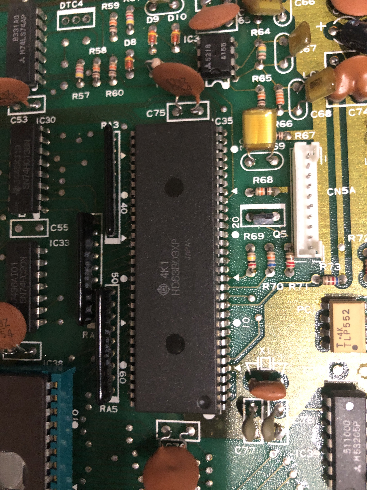|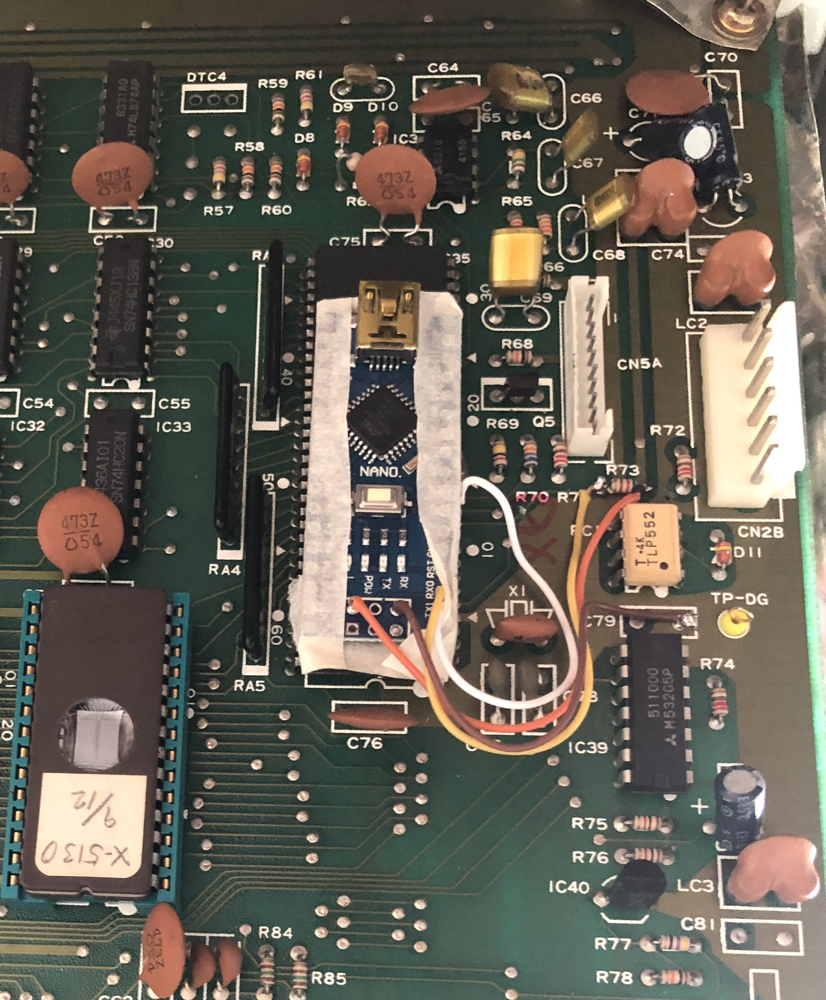
|===
====

[#DW8000]
=== Korg DW8000

[#DSS-1]
=== Korg DSS-1
Mod for Korg DSS-1 was done a little differently which EX8000: by attaching an arduino board to a MIDI socket board - a KLM-788 Jack panel. See circuit diagram below...

====
 - Power is taken from the closest points to the CN26B connector (pin #5 and #6 ).
 - The power plug for the arduino is also placed on thermo-plastic, and the arduino is already fixed on it, at 90 degrees/"edge" to the KLM-788 board.
 - To connect RX and TX using an additional connecting plug, I made a break in the wire from pin#2 of the same CN26B socket, going to the main board KLM-781 CPU-II - HD63B03X.
====
The nuance is that you don’t confuse where to connect the ends of Tx and Rx:
====
- *Rx* end connect to the end going to the socket pin # 2 CN26B,
- *Tx* end to the trim going to the main board of the KLM-781 processor HD63B03Xb as IC11
====
.pin frame connection of HD63B03Xb processor:
[%collapsible]
====
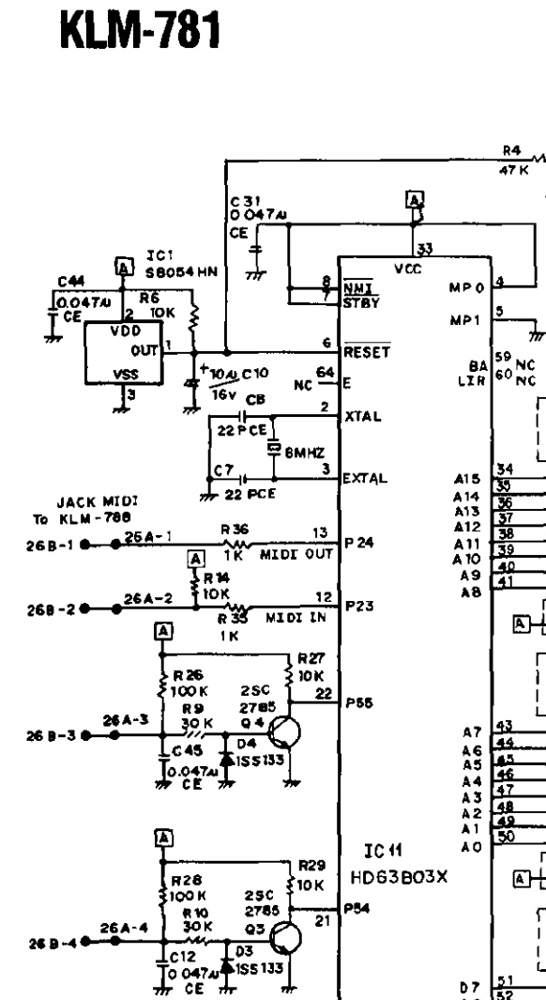

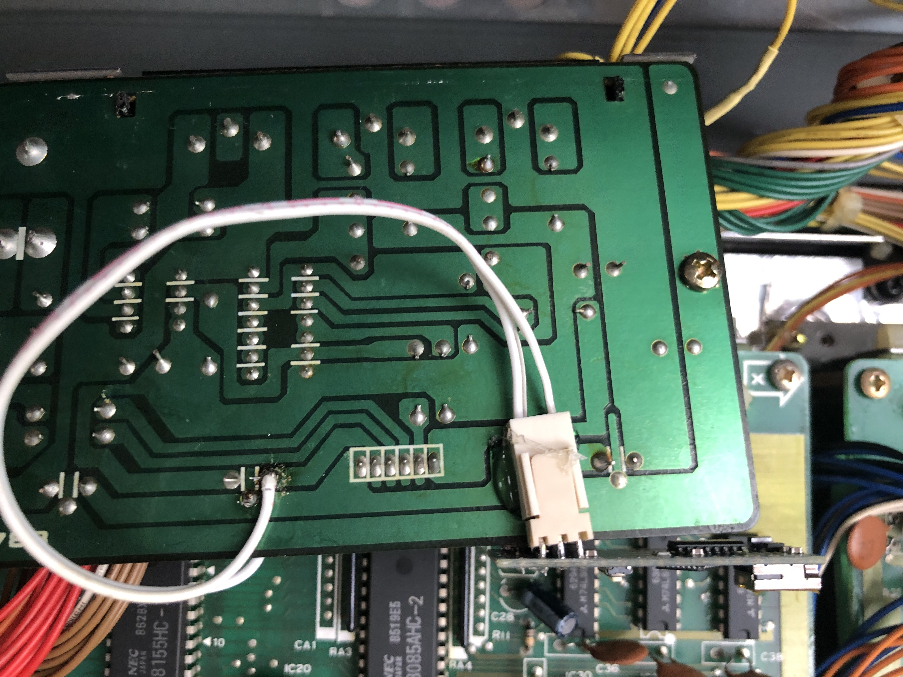
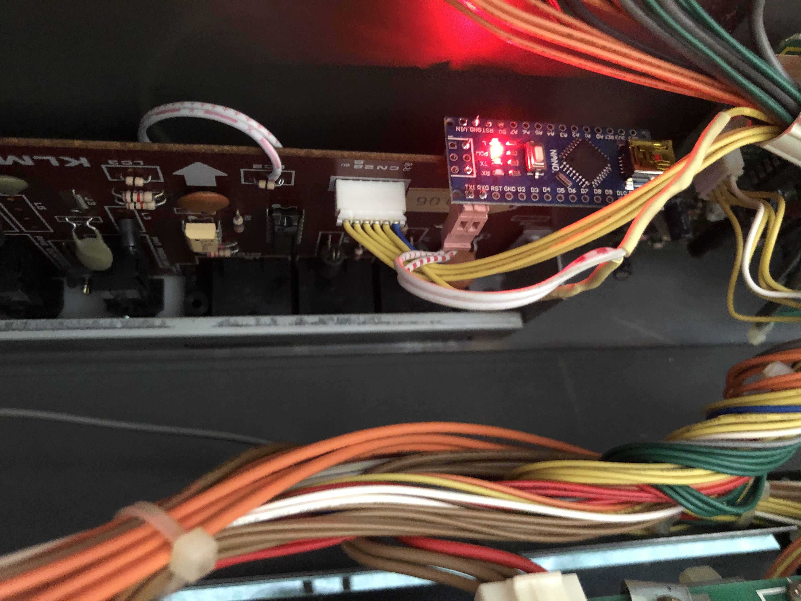
====

The design turned out to be more clear when opening the top cover of the synth and an easy
ability the Arduino unit can be removed for reprogramming of the code.

kbd:[<<Back-to-Top>>]

[#Controller]
== Controllers review

[%collapsible]
====
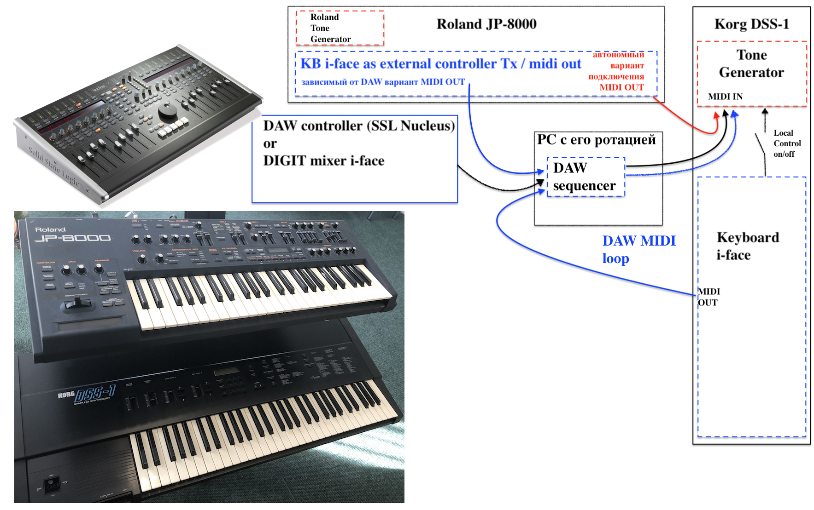
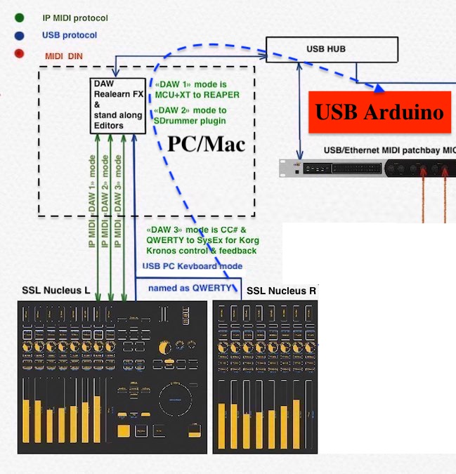
====

[#Nucleus]
=== SSL Nucleus
My Arduino project had limitations when designing the lookup table/template: <<Nucleus>> controller (see the <<table2>>)
I was limited by the controller's capabilities due to its tight binding of CC# to such interface surface elements
- as a result of which there a exception list upto 24 unused elements from 64 was formed, that unsuitable be mapping with the desired DSS-1 parameters due to their limitation of the on/off-state only.
In a situation where more targes level of change are required (at least 4 or 16 levels)...
The SSL engineers decision was somehow strange to software exclude the central group of CC# (from 32 to 63) from the control list and continue further from 64 to 95 of CC#?!
Due to this limitation,I had to try to at least somehow use the SW buttons on program parameters that require more than 3-4 switching values.
Because of this nuance, only the minimum and maximum values assigned to the parameter are switched by CC# on / off. such as:

|===
|Program parameter name|Function and range| notes
|`Osc MG Mod Selelect`| Sw Off (Osc1, Osc2) Both|[NOTE]
|||within parentheses wouldn't work if use off/on Switchs.
|===

I’ll immediately voice some notes present in the code as an addition:
where in brackets are the values that are unattainable when using the button 0-127

.example: MCU & XT Projections
[%collapsible]
====
|===
|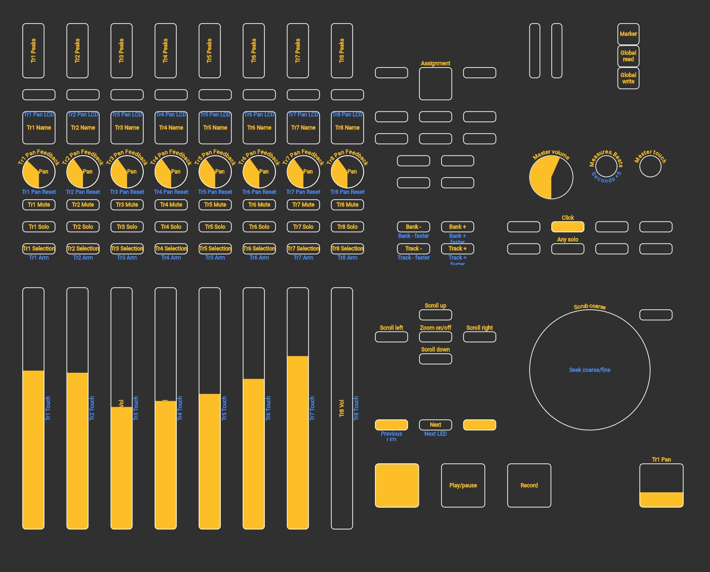 |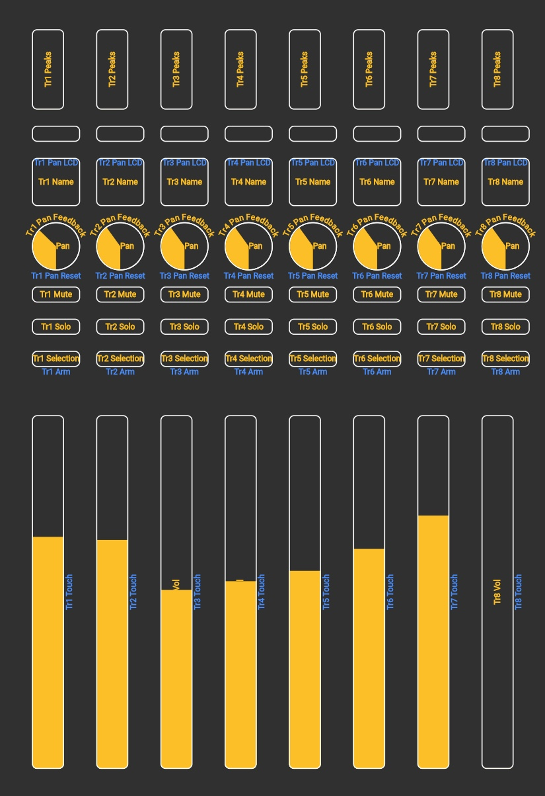
2+|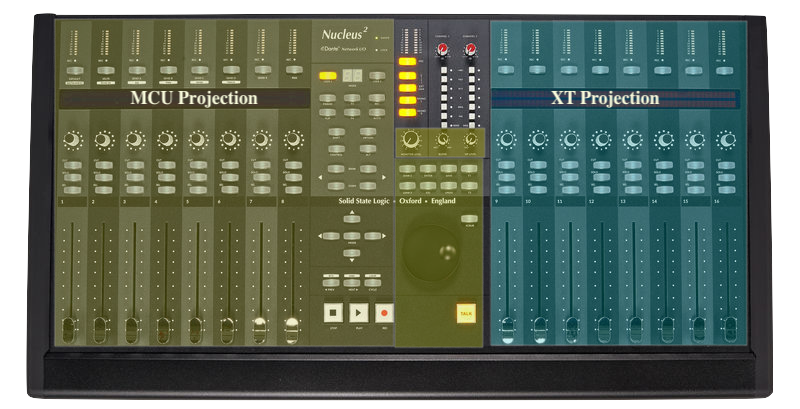
|===
====

[#JP800]
=== Roland JP8000
I have plans to develop a translator for Korg DSS-1 using a Roland JP-8000 or 8080 sirface,
but it will take time.
I would appreciate your support in developing this code and prepearing the https://docs.google.com/spreadsheets/d/e/2PACX-1vS_MgseDMfFZ4kXgkw-xd4UQfN1EQT1Eah-EatsXftWYqnoR4LhTuFTRf-FguK1YDWzdkhAhz0rsqB0/pubhtml[mapping table between Roland JP8000/8080 and Korg DSS1]

.staff photo
[%collapsible]
====
image:IMAGES/Korg DSS-1/Roland JP8000 + Korg DSS-1.png[,600,400]
====

kbd:[<<Back-to-Top>>]

[#code]
== Coding review:

=== Preparation for DSS-1 coding:
There are base difference in the description of the implementation chart for DW8000 vs DSS-1:

 .the First:
====
- DW8000 parameters range from 0 to 64 (or upto 6b of SysEx length) in 7 categories:
- DSS-1 parameters vary from 0 to 127 and even upto 500 points; it increase the range categoties up to 12
(it mean SysEx length to 7b and upto 10b and more if you wish manupulating mod request parameter of synth)
Therefore, it was necessary to analyze and remake the CC Value transformation system to the additional parameters of the DSS1 regulation range that appeared.
====

 .the Second:
====
The parameter correspondence table in code for DW8000 isn't suitable for DSS-1 mapping, so I had to compeared and refer to the https://glenstegner.com/dss1/home.html[service manual Korg DSS-1]
and the https://gearspace.com/board/electronic-music-instruments-and-electronic-music-production/1418944-korg-dss-1-arduino-upgrade-project.html#:~:text=DSS%2D1_SysEx%20analytical%20table[DSS-1_SysEx excel table],
which is available on the website: 

Glen Stegner is very deeply described all the possibilities in the work of DSS-1.
Therefore, I also pay tribute and respect to Glen Stegner in his preparation of the site.
Including there are certain nuances when implementing Sisex commands, which I left for later and placed them in the last section <<troubleshooting>>:
====

 .The Third:
====
the parameters `DDL 1&2 Time` have control range from *0~500*, and it was necessary to create additional processing
to transform the CC# range (0-127)into the expected one, implement 9-byte SysEx distribution over MSB LSB nibbles.
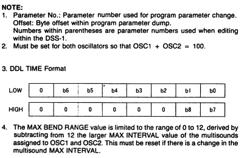

====

 .The Four:

====

====
On this basis, a new table of correspondence between DDS-1 parameters and application of parameters to CC# control messages from the controller.

[#Unit]
=== Units code discribtion:
Unfortunately, I’m not a professional coder and apparently you noticed my lack of professionalism even earlier. Therefore,
I describe the process of creating code as a self-taught person. having experience in coding in basic and fortran
when computer centers were relevant and a personal computer was like a spaceship - unattainable. And the current Windows wasn't even 3.1

So, code distributed across 5 different code Units
for preparing and processing MIDI data arriving at the Rx Arduino input

.SysEx byte preparation blocks:
|===
|Sysex_6 byte leight| <<Unit_0>>
|Sysex_8 byte leight| <<Unit_1>>
|Sysex_9 byte leight| <<Unit_2>>
|Sysex_10 byte leight| <<Unit_3>>
|Ctlr_2_Synth map layout| <<Unit_4>>
|setup & loop| *[Unit_5]*
|===

==== parts in progress (Not realized ideas for CC#2SysEx)
At the time of publication of the code, there were unrealized ideas for processing the remaining SysEx commands located in the section <<Unit_0>> as:

[,cpp,%linenums]
----
Sysex hex[4]:  functionDec## [ ID ] name of param	action		status at 2023:
case  0x10: // functionID 16 [id10] Program Param	Request		--
case  0x11: // functionID 17 [id11] Write		Request		--
case  0x12: // functionID 18 [id12] Mode		Request		done
case  0x13: // functionID 19 [id13] Play mode 		Request		done
case  0x14: // functionID 20 [id14] PCM data		Request		researching
case  0x15: // functionID 21 [id15] MSound parameter	Request		--
case  0x16: // functionID 22 [id16] MSound list		Request		in progress
case  0x17: // functionID 23 [id17] Program nameList	Request		in progress
case  0x40: // functionID 64 [id40] Program paramDump 	Tx/Rx		in progress
case  0x41: // functionID 65 [id41] Program *parameter Change*		done
case  0x42: // functionID 66 [id43] Mode data		Tx only		---
case  0x43: // functionID 67 [id43] PCM data Dump	Tx/Rx		researching
case  0x44: // functionID 68 [id44] MSound param Dump	Tx/Rx		researching
case  0x45: // functionID 69 [id45] MSound list		Tx/Rx		in progress
case  0x46: // functionID 70 [id46] Program nameList	Tx only		---
----

[#Unit_0]
==== [Unit_0]
====
the first block provides preparation of the length Sysex_6 bytes for executing only request commands for modifying the Korg DSS-1 synthesizer without providing transformation of the value byte.
This was implemented at the very last moment and represents the most interesting section for further development in case of interest from both the code supporter and the performer himself.
Therefore, any help and cooperation is accepted!
====
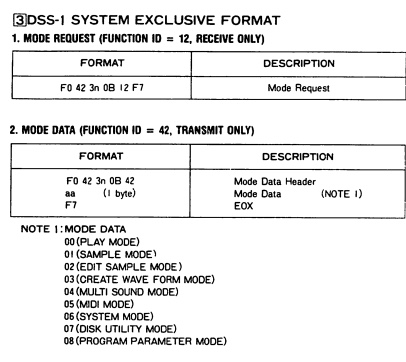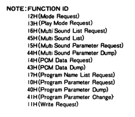

From my little programming experience, I can say that I used Pocket MIDI software to monitor MIDI messages and because of it
I got into trouble when compiling the CC#2SysEx correspondence table due to combining data in decimal & hex formats at IN/OUT monitor,
which led to a fatal error at the last stage of the redesign.

[TIP]
When working with correspondence tables, use Excel tables and convert hex or DEC data into a single, readable format.
But taking into account how SysEx and CC# will be presented when debugging with a MIDI monitor.

Function ID [Fxx] - a convenient parameter when focusing on the built-in interface of Korg DSS-1, which is indicated on the surface and LCD
of the synthesizer and was ignored by the developers in previous versions of the code and Excel tables from GlenStegner.

kbd:[<<Back-to-Top>>]

[#Unit_1]
==== [Unit_1]
this is the main code for transforming the largest array of parameters with length SysEx = 7b (or range = 64)
[%collapsible]
====
[,cpp,%linenums]
----
// Main DSS-1: Scaling SysEx_8 lenght for paramNumber of [5]
void sendParam_8(byte channel, byte paramNumber, byte paramValue7Bit)// Unit_1
{
  const int sysexLen = 8;
  static byte sysexData[sysexLen] = {
	0xF0, // 0 Sysex start
	0x42, // 1 Manufacturer ID: 42, Korg
	0x30, // 2 Channel 1
	0x0B, // 3 Device ID: 0b, DSS-1
	0x41, // 4 Function ID: 41, Program Parameter change
	0x00, // 5 Parameter number (which parameter we want to change)
	0x00, // 6 Parameter value
	0xF7  // 7 EOX
  };
  // paramValue7Bit is assumed to run from 0 to 127 in all cases,
  paramValue7Bit &= 0x7f;
  // so here we rescale to fit to appropriate bit width for each parameter
  byte paramValueScaled = 0;
  switch (paramNumber) {
  case 0x04: // paramNumber 4  (2) VCF Mode/Slope
  case 0x05: // paramNumber 5  (2) VCF EG Polarity
  case 0x26: // paramNumber 38 (2) ATch VCF Mode
  case 0x29: // paramNumber 41 (2) JStck VCF Mode
  case 0x33: // paramNumber 51 (2) DDL-2 In Sel
  case 0x39: // paramNumber 57 (2) DDL-2 Mod Invert
  case 0x3D: // paramNumber 61 (2) Sync Mode
  case 0x48: // paramNumber 72 (2) A.Bend Polar.Mode
    paramValueScaled = paramValue7Bit >> 6; break;
  case 0x43: // paramNumber 67 (4) Osc MG Select
  case 0x47: // paramNumber 71 (4) A.Bend Select
  case 0x4D: // paramNumber 77 (4) Unison Voices
    paramValueScaled = paramValue7Bit >> 5; break;
  case 0x4A: // paramNumber 74 (8) Unison Detune
    paramValueScaled = paramValue7Bit >> 4; break;
  case 0x1C: // paramNumber 28 (16) Veloc VCF Cutoff
  case 0x24: // paramNumber 36 (16) ATch OSC MG Intens
  case 0x25: // paramNumber 37 (16) ATch VCF Level
  case 0x27: // paramNumber 39 (16) ATch VCA Level
  case 0x2F: // paramNumber 47 (16) DDL-1 Feedback
  case 0x30: // paramNumber 48 (16) DDL-1 FX Level
  case 0x35: // paramNumber 53 (16) DDL-2 Feedback
  case 0x36: // paramNumber 54 (16) DDL-2 FX Level
  case 0x3A: // paramNumber 58 (16) Osc 1 MSound
  case 0x3B: // paramNumber 59 (16) Osc 2 MSound
  case 0x46: // paramNumber 70 (16) OSC MG Delay
    paramValueScaled = paramValue7Bit >> 3; break;
  case 0x44: // paramNumber 68 (32) OSC MG Freq.
  case 0x49: // paramNumber 73 (32) A.Bend /Porta.Time
  case 0x4B: // paramNumber 75 (32) Veloc OSC X-Switch
    paramValueScaled = paramValue7Bit >> 2; break;
  case 0x03: // paramNumber 3  (64) Noise Level
  case 0x07: // paramNumber 7  (64) VCF EG Intens
  case 0x08: // paramNumber 8  (64) VCF Resonance
  case 0x09: // paramNumber 9  (64) VCF Kbd Track
  case 0x0A: // paramNumber 10 (64) VCF MG Freq.
  case 0x0B: // paramNumber 11 (64) VCF MG Delay
  case 0x0C: // paramNumber 12 (64) VCF MG Intens
  case 0x0D: // paramNumber 13 (64) VCF EG Attack
  case 0x0E: // paramNumber 14 (64) VCF EG Decay
  case 0x0F: // paramNumber 15 (64) VCF EG BrPoint
  case 0x10: // paramNumber 16 (64) VCF EG Slope
  case 0x11: // paramNumber 17 (64) VCF EG Sustain
  case 0x12: // paramNumber 18 (64) VCF EG Release
  case 0x14: // paramNumber 20 (64) VCA Level
  case 0x15: // paramNumber 21 (64) VCA EG Attack
  case 0x16: // paramNumber 22 (64) VCA EG Decay
  case 0x17: // paramNumber 23 (64) VCA EG BrPoint
  case 0x18: // paramNumber 24 (64) VCA EG Slope
  case 0x19: // paramNumber 25 (64) VCA EG Sustain
  case 0x1A: // paramNumber 26 (64) VCA EG Release
  case 0x1B: // paramNumber 27 (64) VelSns ABend Intens
  case 0x1D: // paramNumber 29 (64) VelSns VCF EG Attack
  case 0x1E: // paramNumber 30 (64) VelSns VCF EG Decay
  case 0x1F: // paramNumber 31 (64) VelSns VCF EG Slope
  case 0x20: // paramNumber 32 (64) VCA EG Intensity
  case 0x21: // paramNumber 33 (64) VelSns VCA EG Attack
  case 0x22: // paramNumber 34 (64) VelSns VCA EG Decay
  case 0x23: // paramNumber 35 (64) VelSns VCA EG Slope
  case 0x2C: // paramNumber 44 (64) DDL MG-A Freq
  case 0x2D: // paramNumber 45 (64) DDL MG-B Freq
  case 0x31: // paramNumber 49 (64) DDL-1 MG-A Intens
  case 0x32: // paramNumber 50 (64) DDL-1 MG-B Intens
  case 0x37: // paramNumber 55 (64) DDL-2 MG-A Intens
  case 0x38: // paramNumber 56 (64) DDL-2 MG-B Intens
  case 0x41: // paramNumber 65 (64) Osc 2 Detune
  case 0x45: // paramNumber 69 (64) OSC MG Intensity
    paramValueScaled = paramValue7Bit >> 1; break;
  case 0x02: // paramNumber 2 (128) A.Bend Intes/PortaMix
  case 0x06: // paramNumber 6 (128) VCF Cutoff
  case 0x13: // paramNumber 19(128) VCA Kbd Decay
    paramValueScaled = paramValue7Bit; break;
  // for this param below we are use ariphmetic ops:
  case 0x3F: // paramNumber 63  (3) Osc 1 Octave
  case 0x40: // paramNumber 64  (3) Osc 2 Octave
  case 0x4C: // paramNumber 76  (3) Key Assign mode
    paramValueScaled = paramValue7Bit/43; break;
  case 0x3E: // paramNumber 62  (5) Bit DA Resolution
    paramValueScaled = paramValue7Bit/26; break;
  case 0x42: // paramNumber 66 (12) Osc 2 Interval
    paramValueScaled = paramValue7Bit*24/256; break;
  case 0x28: // paramNumber 40 (13) JStck PBend Range
  case 0x2A: // paramNumber 42 (13) EQ Bass
  case 0x2B: // paramNumber 43 (13) EQ Treble
  case 0x3C: // paramNumber 60 (13) Max OSC Band Range
    paramValueScaled = paramValue7Bit*26/256; break;
  case 0x00: // paramNumber 0 (101) Osc 1 Level
  case 0x01: // paramNumber 1 (101) Osc 2 Level
    paramValueScaled = paramValue7Bit*203/256; break;
  default:
  return;	// unknown parameter - ignore
  }
  sysexData[2] = 0x30 | ((channel - 1) & 0x0f);
  sysexData[5] = paramNumber;
  sysexData[6] = paramValueScaled;
  MIDI.sendSysEx(sysexLen, sysexData, true);
}
----
====

kbd:[<<Back-to-Top>>]

[#Unit_2]
==== [Unit_2]
The Unit_2 oparation is made for `DDL1 & 2 Time` range only. and it's make 9 bytes lenght of SysEx
Here the parameter value range is increase by transformation 252/64 from 127 to 500 max point,
and shifting the data to the left 7 bytes for the MSB.

[%collapsible]
====
[,cpp,%linenums]
----
// Scaling SyxEx_9 lenght for DDL1&2 Time, LSB & MSB bytes only:
void sendParam_9(byte channel, byte paramNumber, byte paramValue7Bit) // Unit_2
{
  const int sysexLen = 9;
  static byte sysexData[sysexLen] =
  {
    0xF0, // 0 SOX
    0x42, // 1 Manufacturer ID: 42, Korg
    0x30, // 2 Channel 1
    0x0B, // 3 Device ID: 0b, DSS-1
    0x41, // 4 Function ID: 41, Program Parameter change
    0x00, // 5 Parameter number (which parameter we want to change)
    0x00, // 6 Parameter low byte
    0x00, // 7 Parameter high byte
    0xF7  // 8 EOX
  };
  paramValue7Bit &= 0x7f;
  int paramValueScaled = 0;
  switch (paramNumber) // So here we rescale to fit to range:
  {
	  case 0x2E: // [F81] paramNumb 46 DDL-1 Time (500)
	  case 0x34: // [F92] paramNumb 52 DDL-2 Time (500)
	  paramValueScaled = paramValue7Bit*252/64; break;
	  default: return;	// unknown parameter - ignore
  }
  sysexData[2] = 0x30 | ((channel - 1) & 0x0f);	// Set channel number
  sysexData[5] = paramNumber;
  sysexData[6] = paramValueScaled & 0x7f;		// LSB of 14-bit value
  sysexData[7] = (paramValueScaled >> 7) & 0x03;// MSB
  MIDI.sendSysEx(sysexLen, sysexData, true);
}
----
====

kbd:[<<Back-to-Top>>]

[#Unit_0]
==== [Unit_3]

The Unit_3 preparation make 10 lenght SysEx with 2 parameter changes for OSC mix ratio only.

  * `paramNumber 0 OSC1 level` - as a master parameter
  * `paramNumber 1 OSC2 level` - as a slave, operating in antiphase motion to OSC 1
to satisfy the condition (OSC 1 + OSC 2) = 100%  see Notes <<troubleshooting>>

also here the parameter value range is reduce by transformation 203/256 from 127 to 100 max point
with combine the data to the 10 byte lenght for SysEx message.
[%collapsible]
====
[,cpp,%linenums]
----
// Scaling SyxEx_10 lenght of OSC mix ratio using by one CC# source:
void sendParam_10(byte channel, byte paramNumber, byte paramValue7Bit) { // Unit_3
  const int sysexLen = 10;
  static byte sysexData[sysexLen] = {
    0xF0, // 0 SOX
    0x42, // 1 Manufacturer ID: 42, Korg
    0x30, // 2 Channel 1
    0x0B, // 3 Device ID: 0b, DSS-1
    0x41, // 4 Message: 41, Parameter change
    0x00, // 5 Parameter number (1-st param witch we going to change)
    0x00, // 6 Parameter master value
    0x00, // 7 Parameter number (be as slave)
    0x00, // 8 Parameter slave value
    0xF7  // 9 EOX
    };

    paramValue7Bit &= 0x7f;
    int paramValueScaled;
    switch (paramNumber) { // so here we rescale to fit to range:
    case 0x00: // [F14] paramNumber 0 OSC1 level Mix ratio (master)
	case 0x01: // [F14] paramNumber 1 OSC2 level Mix ratio (slave)
	paramValueScaled = paramValue7Bit*203/256; break;
    default:
    return;	// unknown parameter - ignore
   }
    sysexData[2] = 0x30 | ((channel - 1) & 0x0f);// Set channel number
    sysexData[5] = paramNumber; // master must be (master+slave) == 100%:
    sysexData[6] = paramValueScaled & 0x7f; // master value
    sysexData[7] = (paramNumber +1); // slave
    sysexData[8] = (100 - paramValueScaled) & 0x7f; // slave value
    MIDI.sendSysEx(sysexLen, sysexData, true);
}
----
====

[NOTE]
====
If yoy wish separate control for OSC 1 and OSC 2 levels by separate SysEx messages like:

  * [F14] paramNumber 0: `[F0 42 30 0B 41 00 xx F7]`
  * [F14] paramNumber 1: `[F0 42 30 0B 41 01 xx F7]`

then have to thick how to do the remap by <<unit_4>> only:

for exsample: Change 2 strings of code: `371` & `372` like this:
[#exsample]
----
371    //case 1: sendParam_8(channel, 69, value); break;// [F17] OSC MG intens		reserved CC#1
272    //case 2: sendParam_8(channel, 12, value); break;// [F34] VCF MG intens		reserved CC#2
----
change to:
----
 371   case 1: sendParam_8(channel, 0, value); break; // [F14] 00 OSC1 Level		use by separately!
 372   case 2: sendParam_8(channel, 1, value); break; // [F14] 01 OSC2 Level		use by separately!
----
and have to comment out on string 395:
----
395    //case 23: sendParam_10(channel, 0, value); break;// [F14] OSC Mix ratio		+[F14] 01 OSC2 Level
----
but in this case you will lose control over

  * `[F17] OSC MG intens`		whitch reserved for direct CC#1 message
  * `[F34] VCF MG intens`		reserved for CC#2 message too

it`s will be your choice...
====

kbd:[<<Back-to-Top>>]

==== [Unit_4]

It is the main processing unit for *Ctlr_2_Synth* map layouts and is shown in section <<map>>
Each user comes up with the basic principle of correspondence for this table independently!
based on your stereotypes and convenience when manipulating the parameters of the synthesizer using the control panel...
Plus, there are a number of limitations from both the controller and the synthesizer. For example:
list and its number of parameters with smooth adjustment/change of parameter. in my case:

[#table2]
.comparative table "number of control elements and number of parameters to control"
|===
|element type/parameter|Nucleus|JP8000|DW-8p|EX/DW8000|DSS-1| note for DSS-1 parameters:

|multirange (fader & rotary V-coder)|32|56|48|48|60+| incl.4 mode,8 request,6 CC#:
|2 range (switch, button)|32|8(+8)|2|2(+3)|16(+12)| CC#1, 2, 7, 122, 123, (124-125)
|Total|64|64(+8)|50|50(+3)|78(+12)| but most DSS-1 params don't require permanent controlling.
|===
Therefore, everyone has a decigion and a dilemma of priorities:
- what to choose and how to use it with such varied choices...
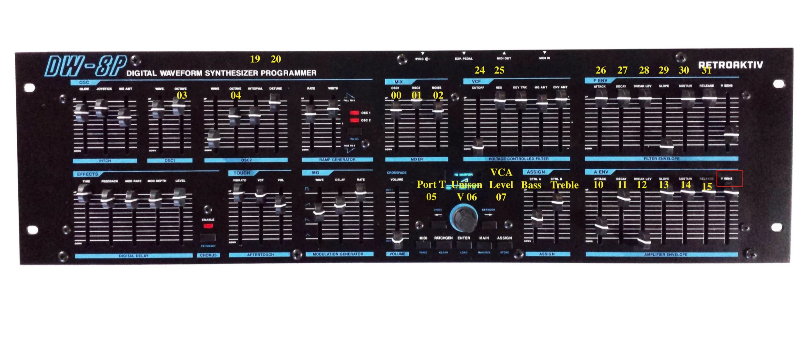

kbd:[<<Back-to-Top>>]

[#inplementation]
== MIDI implementation charts

=== Parameter list origin

.Korg DSS-1 Midi iplementation chart [3]
[%collapsible]
====
[frame=none]
|===
|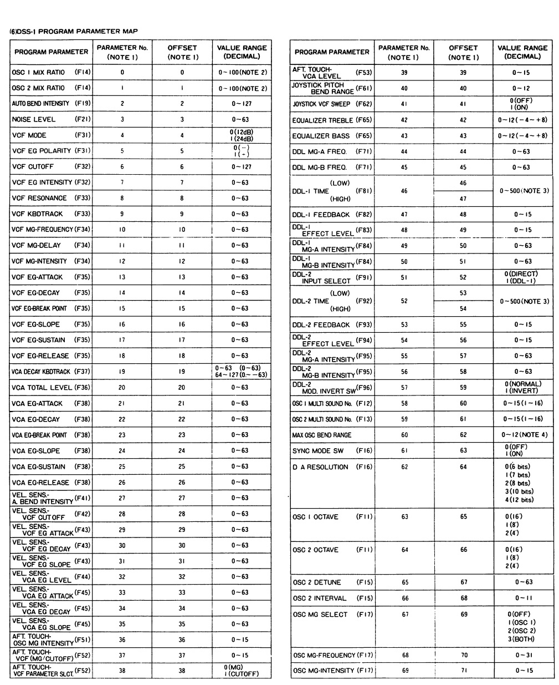|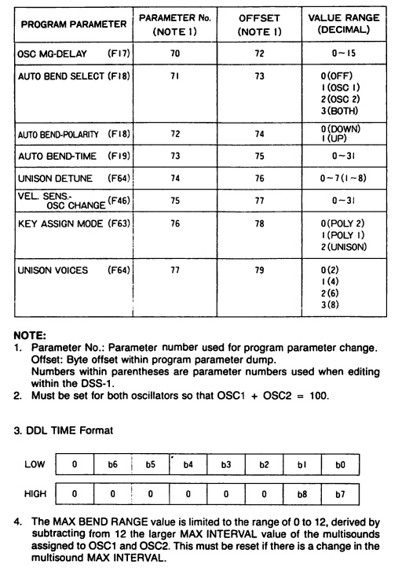
|===
====

====
if You wish remapping CC#2SysEx use the Refer: https://dn790004.ca.archive.org/0/items/sm_DSS-1ServiceManual/DSS-1ServiceManual.pdf[implementation chart `6`DSS-1 Programm parameter map]

Parameter number column "2", at pages 7-8:
====

[WARNING]
not use the *param.Offset* which discribed and use for paramDUMP! Parameter misconception is passed down!
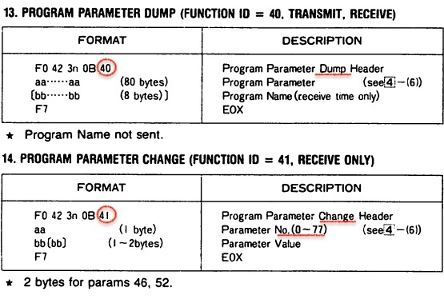

Steve Baines of the first DW8000 hack didn't understand the difference.
https://gearspace.com/board/showpost.php?p=16795924&postcount=16[at gearspace.com have quote his comments]

=== Code parameter listing
Also in the interblock space of code there is a complete list of program parameters
with hex and decimal data correspondence for ease of programming:

.Korg DSS-1 Parameter list
[%collapsible]
====
Korg DSS-1 Parameter list (sorted by paramNumber)
Function ID [Fxx] - a convenient parameter when focusing on the built-in interface of Korg DSS-1,
which is indicated on the surface and LCD of the synthesizer and was ignored by the developers in previous version
of the code by Steve Baines and Excel tables by Glen Stegner.
[,cpp,%linenums]
----
hex[4]	FunID  ParamNumber # range Parameter name
--------------------------------------------------------
--    // [F01] paramNumber--  (-) Initialize parameters
--    // [F02] paramNumber--  (-) Write/Rename
0x12: //[id12] FunctionID 18  (1) Request Mode condition
0x13: //[id13] FunctionID 19  (1) Request Play Mod
0x16: //[id16] FunctionID 22  (1) Request MSound list
0x23: //[id17] FunctionID 23  (1) Request Program name list

hex[5]				  (sorted by paramNumber)
--------------------------------------------------------
0x00: // [F14] paramNumber 0 (101) Osc 1 Lev /OSC mix ratio
0x01: // [F14] paramNumber 1 (101) Osc 2 Level
0x02: // [F19] paramNumber 2 (128) A.Bend Intesity
0x03: // [F21] paramNumber 3  (64) Noise Level
0x04: // [F31] paramNumber 4   (2) VCF Mode/Slope
0x05: // [F31] paramNumber 5   (2) VCF EG Polarity
0x06: // [F32] paramNumber 6 (128) VCF Cutoff
0x07: // [F32] paramNumber 7  (64) VCF EG Intensity
0x08: // [F33] paramNumber 8  (64) VCF Resonance
0x09: // [F33] paramNumber 9  (64) VCF Kbd Track
0x0A: // [F34] paramNumber 10 (64) VCF MG Mod Frequency
0x0B: // [F34] paramNumber 11 (64) VCF MG Mod Delay
0x0C: // [F34] paramNumber 12 (64) VCF MG Mod Intensity
0x0D: // [F35] paramNumber 13 (64) VCF EG Attack
0x0E: // [F35] paramNumber 14 (64) VCF EG Decay
0x0F: // [F35] paramNumber 15 (64) VCF EG Breakpoint
0x10: // [F35] paramNumber 16 (64) VCF EG Slope
0x11: // [F35] paramNumber 17 (64) VCF EG Sustain
0x12: // [F35] paramNumber 18 (64) VCF EG Release
0x13: // [F37] paramNumber 19(128) VCA Kbd Decay
0x14: // [F36] paramNumber 20 (64) VCA Total Level
0x15: // [F38] paramNumber 21 (64) VCA EG Attack
0x16: // [F38] paramNumber 22 (64) VCA EG Decay
0x17: // [F38] paramNumber 23 (64) VCA EG Breakpoint
0x18: // [F38] paramNumber 24 (64) VCA EG Slope
0x19: // [F38] paramNumber 25 (64) VCA EG Sustain
0x1A: // [F38] paramNumber 26 (64) VCA EG Release
0x1B: // [F41] paramNumber 27 (64) Veloc ABend Intens
0x1C: // [F42] paramNumber 28 (16) Veloc VCF Cutoff
0x1D: // [F43] paramNumber 29 (64) Veloc VCF EG Attack
0x1E: // [F43] paramNumber 30 (64) Veloc VCF EG Decay
0x1F: // [F43] paramNumber 31 (64) Veloc VCF EG Slope
0x20: // [F44] paramNumber 32 (64) VCA EG Intensity
0x21: // [F45] paramNumber 33 (64) Veloc VCA EG Attack
0x22: // [F45] paramNumber 34 (64) Veloc VCA EG Decay
0x23: // [F45] paramNumber 35 (64) Veloc VCA EG Slope
0x24: // [F51] paramNumber 36 (16) ATch Osc MG Intens
0x25: // [F52] paramNumber 37 (16) ATch VCF Level
0x26: // [F52] paramNumber 38  (2) ATch VCF Mode
0x27: // [F53] paramNumber 39 (16) ATch VCA Level
0x28: // [F61] paramNumber 40 (13) JStck PBend Range
0x29: // [F62] paramNumber 41  (2) JStck VCF Mode /Sweep
0x2A: // [F65] paramNumber 42 (13) EQ Bass
0x2B: // [F65] paramNumber 43 (13) EQ Treble
0x2C: // [F71] paramNumber 44 (64) DDL MG-A Freq
0x2D: // [F71] paramNumber 45 (64) DDL MG-B Freq
0x2E: // [F81] paramNumber 46(501) DDL-1 Time
0x2F: // [F82] paramNumber 47 (16) DDL-1 Feedback
0x30: // [F83] paramNumber 48 (16) DDL-1 Effect Level
0x31: // [F84] paramNumber 49 (64) DDL-1 MG-A Intens
0x32: // [F84] paramNumber 50 (64) DDL-1 MG-B Intens
0x33: // [F91] paramNumber 51  (2) DDL-2 Input Select
0x34: // [F92] paramNumber 52(501) DDL-2 Time
0x35: // [F93] paramNumber 53 (16) DDL-2 Feedback
0x36: // [F94] paramNumber 54 (16) DDL-2 Effect Level
0x37: // [F95] paramNumber 55 (64) DDL-2 MG-A Intens
0x38: // [F95] paramNumber 56 (64) DDL-2 MG-B Intens
0x39: // [F96] paramNumber 57  (2) DDL-2 Mod Invert
0x3A: // [F12] paramNumber 58 (16) Osc 1 Multisound
0x3B: // [F13] paramNumber 59 (16) Osc 2 Multisound
0x3C: // [F--] paramNumber 60 (13) Max OSC Band Range
0x3D: // [F16] paramNumber 61  (2) Sync Mode
0x3E: // [F16] paramNumber 62  (5) Bit Resolution
0x3F: // [F11] paramNumber 63  (3) Osc 1 Octave
0x40: // [F--] paramNumber 64  (2) Dumper pedal
0x40: // [F11] paramNumber 64  (3) Osc 2 Octave
0x41: // [F15] paramNumber 65 (64) Osc 2 Detune
0x42: // [F15] paramNumber 66 (12) Osc 2 Interval
0x43: // [F17] paramNumber 67  (4) Osc MG Mod Select
0x44: // [F17] paramNumber 68 (32) Osc MG Mod Freq
0x45: // [F17] paramNumber 69 (64) Osc MG Mod Intens
0x46: // [F17] paramNumber 70 (16) Osc MG Mod Delay
0x47: // [F18] paramNumber 71  (4) A.Bend Select
0x48: // [F18] paramNumber 72  (2) A.Bend Polarity Mode
0x49: // [F19] paramNumber 73 (32) A.Bend Time
0x4A: // [F64] paramNumber 74  (8) Unison Detune
0x4B: // [F46] paramNumber 75 (32) Veloc Osc X-Switch
0x4C: // [F63] paramNumber 76  (3) Key Assign mode
0x4D: // [F64] paramNumber 77  (4) Unison Voices
----
====

kbd:[<<Back-to-Top>>]

[#map]
=== Cntrl_2_Synth parameter map table

.Original *Ctlr_2_Synth* map layouts for *Nucleus_2_DSS-1*
[%collapsible]
====
----
//  CC# to corresponding DSS-1 Parameter numbers map: Cntrl_2_Synth map from Unit_4
	CC# [FID] ## hex[5] Parameter	 Name
-------|-----|--|------|------------|---------------
	SSL Nucleus Fader group L
case 0:	[F44] 32 (0x20) paramNumber: VCA EG Intensity
case 1:	[F17] 69 (0x45) paramNumber: OSC MG Mod Intens	reserved CC#1
case 2:	[F34] 12 (0x0C) paramNumber: VCF MG Mod Intens	reserved CC#2
case 3:	[F83] 48 (0x30) paramNumber: DDL-1 FX Level
case 4:	[F94] 54 (0x36) paramNumber: DDL-2 FX Level
case 5:	[F19] 2  (0x02) paramNumber: A.Bend Intesity
case 6:	[F21] 3  (0x03) paramNumber: Noise Level
case 7:	[F36] 20 (0x14) paramNumber: VCA Total Level	reserved CC#7
	SSL Nucleus Fader group R
case 8:	[F65] 42 (0x2A) paramNumber: EQ Bass
case 9:	[F65] 43 (0x2B) paramNumber: EQ Treble
case 10:[F38] 21 (0x15) paramNumber: VCA EG Attack
case 11:[F38] 22 (0x16) paramNumber: VCA EG Decay
case 12:[F38] 23 (0x17) paramNumber: VCA EG BrPoint
case 13:[F38] 24 (0x18) paramNumber: VCA EG Slope
case 14:[F38] 25 (0x19) paramNumber: VCA EG Sustain
case 15:[F38] 26 (0x1A) paramNumber: VCA EG Release
	SSL Nucleus V-Coder group L
case 16:[F32] 7  (0x07) paramNumber: VCF EG Intensity
case 17:[F17] 68 (0x44) paramNumber: OSC MG Mod Freq
case 18:[F46] 75 (0x4B) paramNumber: VelSns OSC X-Sw.
case 19:[F81] 46 (0x2E) paramNumber: DDL-1 Time
case 20:[F92] 52 (0x34) paramNumber: DDL-2 Time
case 21:[F19] 73 (0x49) paramNumber: A.Bend Time
case 22:[F64] 74 (0x4A) paramNumber: Unison Detune
case 23:[F14] 0  (0x00) paramNumber: Osc1 Lev/MixRatio	Master
case 23:[F14] 1  (0x01) paramNumber: Osc2 Lev/MixRatio 	Slave
	SSL Nucleus V-Coder group R
case 24:[F32] 6  (0x06) paramNumber: VCF Cutoff
case 25:[F33] 8  (0x08) paramNumber: VCF Resonance
case 26:[F35] 13 (0x0D) paramNumber: VCF EG Attack
case 27:[F35] 14 (0x0E) paramNumber: VCF EG Decay
case 28:[F35] 15 (0x0F) paramNumber: VCF EG BrPoint
case 29:[F35] 16 (0x10) paramNumber: VCF EG Slope
case 30:[F35] 17 (0x11) paramNumber: VCF EG Sustain
case 31:[F35] 18 (0x12) paramNumber: VCF EG Release
	SSL Nucleus Select SW group L
case 64:[F31] 5  (0x05) paramNumber: VCF EG Polarity	reserved CC#64
case 64:[F--] 64 (0x40) paramNumber: Dumper pedal
case 65:[F62] 41 (0x29) paramNumber: JStck VCF Mode
case 66:[F31] 4  (0x04) paramNumber: VCF Mode/Slope
case 67:[F91] 51 (0x33) paramNumber: DDL-2 In. Select
case 68:[F96] 57 (0x39) paramNumber: DDL-2 Mod Invert
case 69:[F18] 72 (0x48) paramNumber: A.Bend Polar Mode
case 70:[F52] 38 (0x26) paramNumber: ATch VCF Mode
case 71:[ID13]18 (0x0D) Function ID: Play mode			Request
	SSL Nucleus Select SW group R
case 72:[F11] 63 (0x3F) paramNumber: Osc 1 Octave
case 73:[F11] 64 (0x40) paramNumber: Osc 2 Octave
case 74:[F17] 67 (0x43) paramNumber: Osc MG Mod Sel
case 75:[F16] 62 (0x3E) paramNumber: Bit Resolution
case 76:[F63] 76 (0x4C) paramNumber: Key Assign Mode
case 77:[F18] 71 (0x47) paramNumber: A.Bend Select
case 78:[F64] 77 (0x4D) paramNumber: Unison Voices
case 79:[F16] 61 (0x3D) paramNumber: Sync Mode
	SSL Nucleus V-Coder Select group L
case 80:[id12]18 (0x12) Function ID: Mode condition		Request
case 81:[id16]22 (0x16) Function ID: MSound list		Request
case 82:[id17]23 (0x23) Function ID: Program name list		Request
----
====

kbd:[<<Back-to-Top>>]

[#troubleshooting]
== Nuances and troubleshooting

on Glen Stegner's website there is a section on https://glenstegner.com/dss1/home.html[Tips and Trics], which describes very interesting things that are implemented by the manufacturer, but which are evaluated and interpretating by the musicians in two ways.
I would say - based on their preferences of each performer.
  .here is one of them:

- parameters `OSC 1 Level` and `OSC 2 Level`: which are marked on the operating system of the synthesizer as *[F14]* as `OSC Mix ratio` or *X-fader* with manipulation by one fade from the synth surface.
This parameter is also described in the Program Parameter table [3] and has a *note2* below:

image:IMAGES/Korg DSS-1/LSB_MSB_data_format.jpeg[,500,400]

[NOTE]
====
*_Must be set for both oscilator so that OSC1 + OSC2 = 100_*
====

which is not mandatory for the performing musician. because you can manage the parameters separately via Sysex:

 - `Osc 1 level: [F0 42 30 0B 41 00 xx F7]`
 - `Osc 2 level: [F0 42 30 0B 41 01 xx F7]`

or 2nd way:

 - `Osc Mix ratio: [F0 42 30 0B 41 00 xx 01 yy F7]`

.My original code version is implemented as 2
[%collapsible]
====
[,cpp,%linenums]
----
// Scaling SyxEx_10 leight of OSC mix ratio using by one CC# source:
void sendParam_10(byte channel, byte paramNumber, byte paramValue7Bit) { // Unit_3
  const int sysexLen = 10;
  static byte sysexData[sysexLen] = {
    0xF0, // 0 SOX
    0x42, // 1 Manufacturer ID: 42, Korg
    0x30, // 2 Channel 1
    0x0B, // 3 Device ID: 0b, DSS-1
    0x41, // 4 Message: 41, Parameter change
    0x00, // 5 Parameter number (1-st param witch we going to change)
    0x00, // 6 Parameter master value
    0x00, // 7 Parameter number (be as slave)
    0x00, // 8 Parameter slave value
    0xF7  // 9 EOX
    };
    paramValue7Bit &= 0x7f;
    int paramValueScaled;
    switch (paramNumber) { // so here we rescale to fit to range:
        case 0x00: // [F14] paramNumber 0 OSC1 level Mix ratio (master)
	case 0x01: // [F14] paramNumber 1 OSC2 level Mix ratio (slave)
	paramValueScaled = paramValue7Bit*203/256; break;
    default:
    return;	// unknown parameter - ignore
   }
    sysexData[2] = 0x30 | ((channel - 1) & 0x0f);// Set channel number
    sysexData[5] = paramNumber; // master must be (master+slave) == 100%:
    sysexData[6] = paramValueScaled & 0x7f; // master value
    sysexData[7] = (paramNumber +1); // slave
    sysexData[8] = (100 - paramValueScaled) & 0x7f; // slave value
    MIDI.sendSysEx(sysexLen, sysexData, true);
}
----
====

====
And this may be a controversial decision, since according to the reasoning on the https://glenstegner.com/dss1/home.html[Glen website]:
- he prefers an independent control option for the `OSC 1 & 2` parameters separetly with the ability to raise the level of both oscillators up to 100%, while training the powerful OUTPUT from the synthesizer.

image::IMAGES/Korg DSS-1/Sysex_Mix_ratio.png[,700,440]
====
My reason was to create authenticity to
- the "DSS like" control method and
- the ability to save the fader control on the SSL Nucleus controller. Plus,
- the argument for *X-fader* control is that it is possible to achieve overload at the DAC output when playing particularly loud waves with distortion.
====
How to avoid this and whether this is considered an artistic decision by the performer is up to everyone to decide for themselves!

kbd:[<<Back-to-Top>>]

